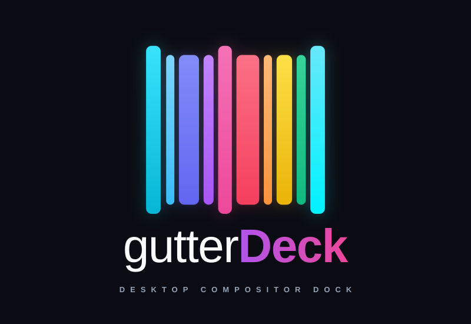

<p align="center">
  
</p>

# gutterDeck v3.0: High-Performance Linux Desktop Compositor Dock

[](https://en.cppreference.com/w/cpp/17)
[](https://www.qt.io/)
[](https://xcb.freedesktop.org/)
[](https://crunchbangplusplus.org/)
[](LICENSE)

**gutterDeck** is a specialized, bare-metal Linux desktop compositor utility and application dock designed for X11 environments. It manages multiple fullscreen applications behind sleek, razor-thin, animated edge gutters acting as physical accordion tabs for user-defined "decks."

Rather than managing chaotic floating windows, alt-tabbing through dozens of open applications, or relying on heavy tiling window managers with steep learning curves, gutterDeck treats your screen as an expansive deck of cards. The active application occupies the center of the display, flanked at the screen boundaries by tactile colored gutter tabs. Selecting another deck triggers a fluid, hardware-accelerated curtain transition, sliding the new application into view while automatically rebalancing the accordion tabs.

---

## Table of Contents

1. [The Vision & Original Intent](#1-the-vision--original-intent)
2. [The Engineering Odyssey: Steps, Pitfalls & Lessons Learned](#2-the-engineering-odyssey-steps-pitfalls--lessons-learned)
   - [Phase 1: The Python Prototype (`source_python/`)](#phase-1-the-python-prototype-source_python)
   - [Phase 2: C++ v1 — The First Native Attempt](#phase-2-c-v1--the-first-native-attempt)
   - [Phase 3: C++ v3 — The Ground-Up Rebuild & Architectural Breakthroughs](#phase-3-c-v3--the-ground-up-rebuild--architectural-breakthroughs)
3. [Architecture & System Design](#3-architecture--system-design)
   - [Layer Decomposition](#layer-decomposition)
   - [Subsystem Tour](#subsystem-tour)
4. [Feature Deep Dive: What It Can Do & How](#4-feature-deep-dive-what-it-can-do--how)
   - [3-Stage Gutter Swell Dynamics](#3-stage-gutter-swell-dynamics)
   - [The "Holy Grail" Single-Canvas Overlay](#the-holy-grail-single-canvas-overlay)
   - [Dynamic XShape Extension Masking](#dynamic-xshape-extension-masking)
   - [Multi-Tier Event-Driven Window Capture](#multi-tier-event-driven-window-capture)
   - [Deadlock-Proof State Machine & Watchdog](#deadlock-proof-state-machine--watchdog)
   - [Top 80px Inactive Dead-Zone Buffer](#top-80px-inactive-dead-zone-buffer)
   - [Tactile Mouse Wheel & Keyboard Navigation](#tactile-mouse-wheel--keyboard-navigation)
   - [Multi-Stage Graceful Session Preservation](#multi-stage-graceful-session-preservation)
   - [Openbox-Styled Dark Management Dialogs](#openbox-styled-dark-management-dialogs)
   - [Procedural Barcode System Tray Icon](#procedural-barcode-system-tray-icon)
   - [Multi-Monitor & Portrait Geometry Targeting](#multi-monitor--portrait-geometry-targeting)
   - [Chrome-Style Multi-Profile Picker & CLI](#chrome-style-multi-profile-picker--cli)
5. [Real-World Use Cases & Workflows](#5-real-world-use-cases--workflows)
6. [Configuration Reference (`config.json` & Profiles)](#6-configuration-reference-configjson--profiles)
7. [Installation, Compilation & Testing](#7-installation-compilation--testing)
   - [Prerequisites (Debian / Ubuntu / Crunchbang++)](#prerequisites-debian--ubuntu--crunchbang)
   - [Building the Project](#building-the-project)
   - [Running Automated Unit Tests (CTest)](#running-automated-unit-tests-ctest)
   - [Sandboxed Development with Xephyr](#sandboxed-development-with-xephyr)
   - [Running on Primary Display](#running-on-primary-display)
8. [Future Roadmap](#8-future-roadmap)

---

## 1. The Vision & Original Intent

Modern desktop workflows frequently demand switching between several full-screen contexts: a code editor, a terminal emulator, a live web preview, database management tools, and communication channels. Traditional window management solutions come with significant cognitive overhead:

- **Floating Window Managers:** Windows constantly overlap, require manual repositioning, and clutter taskbars with dozens of indistinguishable buttons.
- **Tiling Window Managers (i3, bspwm, Sway):** Steer users toward screen partitioning where viewports shrink to unusable fractions, requiring complex keyboard chords just to navigate.
- **Virtual Desktops / Workspaces:** Hide windows completely from peripheral vision, leaving users guessing where specific instances reside and breaking spatial awareness.

### The Original Genesis: Browser Profile Isolation
gutterDeck was originally conceived to solve a specific, high-friction workflow: **managing multiple Google Chrome profiles simultaneously without losing context or mixing sessions**. Web developers and digital operators frequently juggle:
- A personal profile with daily bookmarks and communication.
- A development profile running local servers (`localhost:8080`) with developer extensions.
- A staging/preview profile isolated from caching.
- Client-specific authenticated workspaces.

Toggling between multiple fullscreen Chrome windows using Alt-Tab is notoriously disorienting because every window looks identical in task switchers, and tabs are easily closed or orphaned.

### The Accordion Tab Metaphor
gutterDeck introduced a spatial, physical metaphor: **The Accordion Deck**. 
- Imagine holding an indexed binder. The document you are reading is open in the center.
- Documents preceding it form a thin stack of indexed color-coded tabs on the **left edge** of your screen.
- Documents following it form a stack of tabs on the **right edge**.
- Clicking any tab causes the binder to flip smoothly to that page via an animated sweep, shifting preceding tabs to the left and subsequent tabs to the right.

### Evolution to an Application-Agnostic Dock
While v1 began as a Chrome-focused launcher, **Version 3.0 transformed gutterDeck into a fully generic, application-agnostic desktop compositor dock**. 

Decks are not hardcoded. Each deck is an arbitrary executable shell command defined by the user:
- `google-chrome --profile-directory="Default" --new-window`
- `alacritty` or `x-terminal-emulator`
- `code` (VS Code)
- `responsively` (Multi-device viewport testing)
- `spotify`, `obsidian`, or custom local scripts.

gutterDeck launches each application, captures its X11 window into its managed deck stack, and seamlessly controls visibility, z-ordering, geometry, and transitions.

---

## 2. The Engineering Odyssey: Steps, Pitfalls & Lessons Learned

Building a desktop compositor utility that manipulates foreign application windows on Linux is a notoriously challenging domain fraught with race conditions, window manager quirks, and protocol synchronization hurdles. 

The current rock-solid v3.0 release is the culmination of three major evolutionary phases.

```
┌─────────────────────────────────────────────────────────────────────────┐
│ Phase 1: Python Prototype (PyQt5 + wmctrl + xdotool)                     │
│ ❌ Subprocess latency, shell race conditions, window unmapping flicker   │
└────────────────────────────────────┬────────────────────────────────────┘
                                     │ Lessons Learned
                                     ▼
┌─────────────────────────────────────────────────────────────────────────┐
│ Phase 2: C++ v1 Monolith (Qt6 + Direct XCB)                              │
│ ❌ God Object, signal connection leaks, State Machine deadlock bricking  │
└────────────────────────────────────┬────────────────────────────────────┘
                                     │ Full Re-Architecture
                                     ▼
┌─────────────────────────────────────────────────────────────────────────┐
│ Phase 3: C++ v3.0 Enterprise Architecture                               │
│ ✅ Domain-Driven Design, Holy Grail Overlay, XShape, Watchdog, Graceful  │
└─────────────────────────────────────────────────────────────────────────┘
```

---

### Phase 1: The Python Prototype (`source_python/`)

The initial prototype was written in Python using PyQt5, coordinating window management via shell commands: `subprocess.Popen`, `wmctrl`, and `xdotool`.

#### What Worked in Python
- Proved the visual concept of the 3-state switching lifecycle (`IDLE` → `SWITCHING_OUT` → `SWITCHING_IN`).
- Validated the two-phase curtain animation (slide curtain in over old window → swap windows behind curtain → slide curtain out).
- Verified the accordion geometry formula (`i <= active` tabs pinned left, `i > active` tabs pinned right).

#### Pitfalls & Failures in Python
1. **Subprocess Execution Latency:** Calling `wmctrl` and `xdotool` required spawning separate OS processes on every switch. The fork/exec overhead introduced 80–150ms of input lag, making deck switches feel sluggish.
2. **Window Manager Asynchrony Race Conditions:** Window managers like Openbox process client messages asynchronously. When Python issued `xdotool windowunmap` followed immediately by `xdotool windowmap` and `wmctrl -e` (move/resize), Openbox often received the resize command *before* the window finished mapping. Windows appeared in wrong positions, stuck in maximized states, or failed to resize.
3. **The "Wallpaper Flash" Glitch:** Unmapping the outgoing window before the incoming window fully rendered caused the Linux desktop wallpaper to flash for a split second between deck changes.
4. **Differential Window Capture Fragility:** Python polled `wmctrl -l` in a `time.sleep(0.25)` loop before and after spawning a command, computing set differences (`current_windows - old_windows`) to guess the window ID. If an unrelated background notification or popup appeared during launch, Python captured the wrong window.
5. **The "Invisible App" Lockout:** If a user deleted all decks via context menus, the application entered a headless state with no windows and no UI, leaving the user with no visual way to recover without manually killing the process and hand-editing JSON files.

---

### Phase 2: C++ v1 — The First Native Attempt

To eliminate subprocess overhead, the application was ported to C++17 using Qt6 and direct XCB (`libxcb`, `libxcb-ewmh`). While raw speed increased dramatically, several critical architectural bugs emerged.

#### Pitfalls & Failures in C++ v1
1. **The "God Object" Monolith:** The initial C++ port created a single 1,200-line `GutterDeckApp` class responsible for opening XCB connections, listening to sockets, managing child processes, computing layout math, painting widgets, and dispatching events. It violated every SOLID principle and made debugging isolated issues impossible.
2. **Signal Connection Leaks (Event Multiplication):** In the transition logic, the completion callback for `QPropertyAnimation::finished` was wired via `QObject::connect()` on every deck switch without disconnecting earlier connections. After switching decks 10 times, 10 duplicate callbacks fired simultaneously, causing catastrophic window thrashing and minimizing active windows.
3. **The "Frozen Brick" Deadlock:** If the window manager failed to map a window in time or an animation aborted, the state machine remained stuck in `SWITCHING_OUT`. Because the overlay cleared its XShape mask during switching to block stray clicks, **the entire desktop became permanently unclickable**, locking the user out until they switched to a TTY terminal to kill the process.
4. **Window Manager Geometry Throttling:** C++ v1 attempted to animate top-level X11 windows directly against Openbox. Openbox aggressively throttled rapid `ConfigureRequest` events, causing animations to stutter and jump instead of sliding smoothly.
5. **Fragile Window Title Polling:** Windows were tracked by polling window titles (`findWindowByTitle`). When a browser tab navigated to a new website, its window title changed, permanently breaking the dock's binding.

---

### Phase 3: C++ v3 — The Ground-Up Rebuild & Architectural Breakthroughs

Armed with the lessons from both previous iterations, the project was completely re-architected into **gutterDeck v3.0**. 

Every layer was rebuilt around robust systems engineering standards:
1. **The "Holy Grail" Single-Canvas Overlay:** Top-level X11 windows are never animated directly. Instead, a single full-screen transparent `QWidget` configured with `Qt::X11BypassWindowManagerHint` hosts all gutter tabs and curtain widgets. All animations are rendered internally by Qt's software raster engine at 144Hz.
2. **Dynamic XShape Masking:** The overlay dynamically updates its 1-bit X11 Shape Extension mask. While resting (`IDLE`), the mask matches only the physical bounds of the gutter tabs—the remaining 99% of the screen is completely click-through to underlying applications.
3. **Watchdog-Guarded State Machine:** An integrated hardware-style watchdog timer monitors transitions. If any animation drops or aborts, the watchdog triggers an emergency reset back to `IDLE` within 3 seconds, restoring click-through transparency and permanently eliminating desktop lockouts.
4. **Non-Blocking XCB Event Loop:** Eliminated all polling loops. A `QSocketNotifier` listens directly to `xcb_get_file_descriptor()`, integrating X11 server events (`MapNotify`, `DestroyNotify`, `PropertyNotify`) into Qt's event loop with zero CPU churn.
5. **Multi-Tier Window Discovery:** Windows are matched using a robust 4-tier cascade: PID matching (`_NET_WM_PID`) → `WM_CLASS` inspection → `/proc/<PID>/cmdline` token analysis → sequential launch correlation fallback.
6. **Graceful Isolated Application Closure:** Implemented multi-stage graceful shutdown via `_NET_CLOSE_WINDOW` and `WM_DELETE_WINDOW` targeted strictly to managed window IDs. Eliminates all broadcast `SIGTERM` and `killClient` calls, ensuring that applications sharing a master daemon process (like Google Chrome, GNOME Terminal, or VS Code) keep their external windows open and unharmed outside GutterDeck.

---

## 3. Architecture & System Design

gutterDeck v3.0 is designed strictly following **Domain-Driven Design (DDD)** and **Separation of Concerns (SoC)** across three decoupled layers.

```
                  ┌────────────────────────────────────────────────────────┐
                  │                   PRESENTATION LAYER                   │
                  │  OverlayWindow (Holy Grail Canvas / XShape Masking)    │
                  │  ├── GutterWidget ×N (3-Stage Swell, Tabs, Painting)   │
                  │  ├── CurtainWidget (Two-Phase Smooth Raster Sweep)     │
                  │  ├── SleekDialogs (Dark Input, Color, Add, Reorder)    │
                  │  └── AppIcon (Procedural Barcode Icon & System Tray)   │
                  └───────────────────────────┬────────────────────────────┘
                                              │ signals / slots
                                              ▼
                  ┌────────────────────────────────────────────────────────┐
                  │                      DOMAIN LAYER                      │
                  │  DeckController (Central Coordinator & Orchestrator)   │
                  │  ├── StateMachine (Deadlock-Proof Lifecycle & Watchdog)│
                  │  └── AppLauncher (Process Spawning & PID Capture)      │
                  └───────────────────────────┬────────────────────────────┘
                                              │ interfaces / RAII
                                              ▼
                  ┌────────────────────────────────────────────────────────┐
                  │                  INFRASTRUCTURE LAYER                  │
                  │  XcbConnection (RAII Connection & EWMH Atoms)          │
                  │  XcbEngine (Bare-Metal Window Operations & ICCCM)      │
                  │  WindowWatcher (QSocketNotifier X11 Event Stream)      │
                  │  ConfigManager (JSON Serialization & Bounds Checking)  │
                  └────────────────────────────────────────────────────────┘
```

### Layer Decomposition

#### 1. Presentation Layer (`src/presentation/`)
- **`OverlayWindow`:** A full-screen transparent canvas bypassing the window manager (`Qt::X11BypassWindowManagerHint`, `Qt::WA_TranslucentBackground`). Dynamically applies 1-bit XShape masks so the desktop remains click-through when resting, and solidifies during wipes to capture accidental clicks.
- **`GutterWidget`:** Individual interactive edge tabs. Implements 3-stage swell dynamics, active white accent indicators, center navigation icons, rotated cascading labels, and 80px top buffer protection.
- **`CurtainWidget`:** High-performance transition wipe widget that sweeps across the screen in two phases, masking window minimize and activate operations.
- **`SleekDialogs`:** Custom dark Openbox-styled modal dialogs (`SleekInputDialog`, `SleekColorDialog`, `SleekAddDeckDialog`, `SleekReorderDialog`) with high-contrast text inputs, 24 curated swatches, and opacity sliders.
- **`AppIcon`:** Procedural vector/pixmap generator rendering the vibrant multi-colored barcode icon across resolutions (16px to 512px) with zero external asset dependencies, integrating with the desktop system tray (`QSystemTrayIcon`).

#### 2. Domain Layer (`src/domain/`)
- **`DeckController`:** The high-level orchestrator. Coordinates deck transitions, maps incoming X11 windows to deck slots, binds mouse and keyboard navigation signals, manages context menus, and executes graceful multi-stage application shutdowns.
- **`StateMachine`:** Thread-safe state governor enforcing the `IDLE` → `SWITCHING_OUT` → `SWITCHING_IN` → `IDLE` operational lifecycle. Backed by an automated watchdog timer that guarantees deadlock recovery.
- **`AppLauncher`:** Manages the execution of user shell commands via asynchronous `QProcess` instances, capturing OS process IDs (PIDs) and notifying the controller.

#### 3. Infrastructure Layer (`src/infrastructure/`)
- **`XcbConnection`:** RAII manager for `xcb_connection_t*` and `xcb_ewmh_connection_t`. Initializes core EWMH atoms and provides the raw file descriptor for Qt socket integration.
- **`XcbEngine`:** Direct, bare-metal X11 window management. Dispatches EWMH/ICCCM requests for activation (`_NET_ACTIVE_WINDOW`), minimization (`WM_CHANGE_STATE`), restoration, geometry (`moveResizeWindow`), workspace assignment (`_NET_WM_DESKTOP`), taskbar skipping (`_NET_WM_STATE_SKIP_TASKBAR`), window type docking (`_NET_WM_WINDOW_TYPE_DOCK`), and client closure (`WM_DELETE_WINDOW`).
- **`WindowWatcher`:** Event-driven event listener. Connects a `QSocketNotifier` to the XCB file descriptor to monitor root window events (`MapNotify`, `DestroyNotify`, `PropertyNotify`) without polling.
- **`ConfigManager`:** Loads, validates, and atomically serializes application settings and deck configurations to `~/.config/gutter-deck/config.json`.

---

## 4. Feature Deep Dive: What It Can Do & How

### 3-Stage Gutter Swell Dynamics

To balance aesthetics and ease of use, gutterDeck implements an intelligent **3-Stage Accordion Swell**:

```
[Screen Left]
├── Stage 1: Collapsed Rest (4px hairline strip)
│   - Completely unobtrusive; maximum screen real-estate for your apps.
├── Stage 2: Halfway Swell (24px expansion on edge hover)
│   - Hovering anywhere on an edge expands ALL tabs on that side to 24px.
│   - Displays vertical labels and center icons for effortless target scanning.
└── Stage 3: Full Hover Swell (44px target expansion)
    - Directly hovering a specific tab pops it to 44px with a bright hover highlight.
    - Active deck tab reveals a white accent bar facing the open window.
```

- **Debounced Cursor Transit (40ms):** Moving the cursor rapidly between adjacent tabs on the same edge maintains Stage 2 expansion without flickering or resetting to 4px.
- **Automatic Collapse:** Moving the cursor off the tabs into the application viewport smoothly collapses all tabs back to 4px after 40ms.

---

### The "Holy Grail" Single-Canvas Overlay

gutterDeck avoids fighting X11 window managers by creating a single, fullscreen transparent `OverlayWindow`:
- Configured with `Qt::FramelessWindowHint | Qt::WindowStaysOnTopHint | Qt::X11BypassWindowManagerHint`.
- Set to `Qt::WA_TranslucentBackground` and `Qt::WA_NoSystemBackground`.
- Set to EWMH window type `_NET_WM_WINDOW_TYPE_DOCK` so compositors like Compton/Picom automatically exempt it from drop shadows and window decorations.
- All gutter tabs and the curtain wipe are child widgets within this single canvas, animated via `QPropertyAnimation` with `QEasingCurve::OutCubic` at native refresh rates (60–144Hz) with zero X11 geometry request storms.

---

### Dynamic XShape Extension Masking

A full-screen transparent window normally intercepts all mouse clicks, rendering the desktop unusable. gutterDeck solves this with dynamic **X11 Shape Extension** masking (`updateMask()`):
- **`IDLE` State:** The overlay computes a `QRegion` consisting strictly of the bounding boxes of the visible gutter widgets and applies it via `QWidget::setMask()`. Every pixel outside the physical tabs is completely transparent to the X server—clicks pass straight through to Chrome, VS Code, or your terminal.
- **`SWITCHING` State:** The mask is cleared (`clearMask()`), making the overlay completely solid during curtain transitions. This prevents accidental misclicks while applications are unmapping and mapping.

---

### Multi-Tier Event-Driven Window Capture

When a deck command is executed (e.g. `google-chrome --profile-directory="Profile 1"`), gutterDeck dynamically attaches the resulting top-level X11 window using an event-driven 4-tier identification cascade:

1. **Tier 1 (Direct PID Matching):** Queries `_NET_WM_PID` from the mapped X11 window and matches it against the PID reported by `QProcess`.
2. **Tier 2 (`WM_CLASS` Resolution):** Inspects the window's `WM_CLASS` atom (e.g., `google-chrome`, `Google-chrome`, `Chromium`, `Alacritty`) to match against the executable name.
3. **Tier 3 (Process `/proc/<PID>/cmdline` Token Inspection):** Inspects `/proc/<PID>/cmdline` for parent/child process relationships and fuzzy matches command tokens (e.g. `/opt/google/chrome/chrome` matching `google-chrome`).
4. **Tier 4 (Sequential Launch Queue Correlation):** If a window maps within a brief window following an explicit deck launch while an unassigned deck slot exists, it is automatically correlated and attached.

Once captured:
- `_NET_WM_STATE_SKIP_TASKBAR` is applied so the window does not clutter your desktop panel.
- Window decorations are hidden, and geometry is locked to the target display viewport.

---

### Deadlock-Proof State Machine & Watchdog

To ensure the dock never locks up or freezes your desktop, all operations are governed by `StateMachine`:

```
                 ┌─────────────────────────────┐
                 │            IDLE             │◄────────────────────────┐
                 │  (Mask Active / Click-thru) │                         │
                 └──────────────┬──────────────┘                         │
                                │ requestTransition(SWITCHING_OUT)       │
                                ▼                                        │ Watchdog
                 ┌─────────────────────────────┐                         │ Auto-Recovery
                 │        SWITCHING_OUT        │                         │ Reset
                 │ (Solid Mask / Curtain In)   │                         │ (3000ms)
                 └──────────────┬──────────────┘                         │
                                │ onCurtainPhase1Complete()              │
                                ▼                                        │
                 ┌─────────────────────────────┐                         │
                 │        SWITCHING_IN         │                         │
                 │ (Swap Windows / Curtain Out)│                         │
                 └──────────────┬──────────────┘                         │
                                │ onSwitchComplete()                     │
                                └────────────────────────────────────────┘
```

- **Single-Shot Connections:** All animation completion callbacks use `Qt::SingleShotConnection` to eliminate memory leaks and event stacking.
- **Watchdog Recovery Timer:** An internal timer activates whenever the system leaves `IDLE`. If an animation fails to finish within the timeout (default: 3000ms), the watchdog trips, forces an emergency reset to `IDLE`, and restores the click-through mask.

---

### Top 80px Inactive Dead-Zone Buffer

To ensure gutterDeck never interferes with normal application usage:
- The top **80 pixels** of all gutter tabs are designated as an **inactive dead zone**.
- **Expansion Disabled:** Moving the cursor into the top 80px collapses tabs back to the 4px resting hairline.
- **Clicks Ignored:** Clicks in the top 80px pass through to application titlebars, browser tabs, or window controls.
- **Wheel Ignored:** Mouse wheel scrolling in the top 80px will not cycle decks, allowing normal scrolling of horizontal tab bars.
- **Visual Continuity:** Tabs still render fully to the top of the screen; only interaction is disabled.

---

### Tactile Mouse Wheel & Keyboard Navigation

Switching between decks does not require precision mouse clicking:

- **Tactile Mouse Wheel Scrolling:**
  - Hovering anywhere over the gutter tabs and scrolling the mouse wheel cycles through decks.
  - **Scroll Up:** Switches toward Deck 0 (Previous Deck).
  - **Scroll Down:** Switches toward Deck N (Next Deck).
  - **Notch Accumulator & Debounce:** Accumulates wheel delta up to standard 120-unit detents with a 400ms auto-reset, guaranteeing that one physical mouse wheel click advances exactly one deck without runaway cycling.
  - **Firm Boundary Feedback:** Scrolling past the first or last deck firmly stops (`wrap = false`) rather than wrapping around, providing intuitive physical feedback.
- **Keyboard Navigation:**
  - **Global Alt+Left / Alt+Right:** Low-level X11 key grabs allow cycling decks from anywhere on your desktop.
  - **Local Arrow Keys (`Left` / `Right`) & `A` / `S`:** Supported when a gutter tab has keyboard focus.
  - **Enter / Space:** Activates the focused deck tab.

---

### Multi-Stage Graceful Session Preservation

Forcibly killing applications with `SIGTERM` or `killClient` causes web browsers (e.g. Google Chrome) to exit abruptly without flushing LevelDB database caches or saving session state. On next launch, all pinned tabs disappear and users are greeted with `"Restore pages? Chrome did not shut down correctly"`.

gutterDeck v3.0 implements a **Multi-Stage Graceful Shutdown**:
1. When closing gutterDeck or deleting a deck slot, the overlay UI hides immediately so the desktop feels instant.
2. `DeckController` dispatches standard `_NET_CLOSE_WINDOW` and `WM_DELETE_WINDOW` client messages strictly to managed window IDs.
3. An active polling loop checks client window existence every 50ms up to a 1500ms grace timeout.
4. As soon as all managed deck windows close cleanly, GutterDeck shuts down immediately.
5. If an application window remains open after the grace period (e.g., user clicked "Cancel" on a save prompt), GutterDeck never kills the client or process; it restores taskbar visibility (`_NET_WM_STATE_SKIP_TASKBAR` removed) and leaves the window intact so user work is never lost.
6. Crucially, GutterDeck never sends `SIGTERM` to PIDs or calls `xcb_kill_client`, guaranteeing that external browser windows, terminal sessions, or editors running outside GutterDeck are completely unaffected.

---

### Openbox-Styled Dark Management Dialogs

Right-clicking any gutter tab opens an Openbox-styled dark context menu:

```
┌──────────────────────────────────────┐
│  ✎  Edit Deck Name...                │
│  ⚙  Edit Launch Command...           │
│  🎨 Change Color & Opacity...        │
│  ➕ Add Deck...                      │
│  ↕  Reorder Decks...                 │
├──────────────────────────────────────┤
│  🔀 Switch Profile                 ▶ │
├──────────────────────────────────────┤
│  🗑  Delete Deck                      │
├──────────────────────────────────────┤
│  ✕  Close gutterDeck                 │
└──────────────────────────────────────┘
```

- **Edit Deck Name:** Clean modal to rename the tab label.
- **Edit Launch Command:** Edit the shell command executed on boot.
- **Change Color & Opacity:** Sleek color picker offering 24 modern dark-mode swatches, hex string input, and an interactive alpha opacity slider (0–255).
- **Add Deck:** Dialog to configure a new slot with name, executable command, color swatch, and insertion position (**Left** or **Right** of the active tab).
- **Reorder Decks:** Modal list with **Move Up** and **Move Down** controls to physically rearrange deck positions.
- **Switch Profile:** Submenu displaying all configured profiles, with the currently running profile highlighted (`● Current`). Selecting another profile performs a graceful window handoff (restoring and closing managed windows cleanly before spawning the target profile). Also provides a **Manage Profiles...** option to open the full visual picker directly from the dock.
- **Real-Time Persistence:** Every modification is atomically written to `~/.config/gutter-deck/config.json`.

---

### Vertical & Horizontal Split-Pull View

gutterDeck supports powerful native split-screen functionality that allows you to interact with two applications simultaneously without breaking the spatial accordion metaphor:
- **Activation:** Simply `Shift + Click` on an adjacent gutter tab.
- **Vertical Split (Side-by-Side):** The target display is instantly divided in half vertically (e.g., two `540x1920` windows on a portrait monitor). Both applications remain fully interactive, natively mapped to the X11 server, and receive hardware acceleration.
- **Horizontal Split (Top/Bottom):** Alternatively, split horizontally to stack decks.
- **Instant Exit:** Normal left-clicking on any gutter tab immediately terminates the split view, sweeping the unselected application away and restoring the active deck to full-screen prominence.

---

### Global IPC System Tray Daemon

gutterDeck features a highly advanced, unified system tray manager running as a detached headless daemon (`gutterdeck --tray`). When multiple profiles are launched, they communicate with the daemon seamlessly via Inter-Process Communication (IPC) using `QLocalSocket`:
- **Single Global Presence:** Instead of cluttering your taskbar with multiple icons, the daemon hosts a single, custom procedural barcode icon.
- **Dynamic Context Menus:** Right-clicking the tray builds a hierarchical menu of both your Active and Inactive profiles.
- **IPC Remote Control:** Interacting with an Active profile from the tray instantly fires signals over the local socket to the respective running instance, flawlessly executing `Ctrl+Left/Right` navigation, or spawning native dark-modal config editors directly on the target screen.
- **Inactive Profile Spawning:** Selecting an Inactive profile from the menu auto-discovers your attached monitors and lets you spawn a new hardware-accelerated overlay explicitly onto the screen of your choice (e.g. `Launch on Display 2 (HDMI-1)`).

---

### Global Mouse-Wheel Navigation

gutterDeck hooks deeply into the native X11 display server via `xcb_grab_button` to intercept global mouse scroll events. 
- **The Magic:** From anywhere on your screen, without ever having to move your mouse back to the physical edge gutters, simply hold `Ctrl + Shift` and scroll your mouse wheel. 
- **The Result:** The event bypasses your active application entirely and natively commands gutterDeck to whip the curtain back and forth across your decks in 250 milliseconds.

---

### Procedural Barcode Icon Design

The unified tray daemon boasts a multi-colored **barcode-style application icon**:
- **Visual Design:** 10 vibrant, distinct neon color bars (Electric Cyan, Sky Blue, Vivid Indigo, Neon Purple, Hot Pink, Coral Crimson, Bright Orange, Electric Gold, Emerald Green, Neon Mint) set against an obsidian squircle (`#181924`).
- **Procedural Rendering:** Rendered natively via `QPainter` in `AppIcon.cpp` across multiple resolutions (16, 24, 32, 48, 64, 128, 256, 512px) with zero external PNG/SVG asset dependencies.

---

### Multi-Monitor & Portrait Geometry Targeting

gutterDeck provides native configuration support for multi-monitor setups and dedicated vertical/portrait screens:
- **`target_screen`:** Set to `"auto"` to automatically attach to the display where your mouse cursor is located, or specify an explicit display name (e.g. `"HDMI-1"`, `"DP-1"`).
- **Portrait Dimensions:** Setting `"screen_width": 1080` and `"screen_height": 1920` constrains the overlay and all managed application windows strictly to that screen, preventing geometry from spilling across virtual desktop boundaries.
- **Workspace Locking:** Setting `"target_workspace": 0` binds gutterDeck to a specific virtual desktop, hiding the overlay when switching to other workspaces.

---

### Chrome-Style Multi-Profile Picker & CLI

gutterDeck supports completely isolated configuration profiles. This allows you to create completely separate groupings of decks (e.g., a "Work" profile, a "Gaming" profile, and a "Casual" profile), each with their own decks, names, commands, and colors.

- **Profile Picker Screen:** Running `gutterdeck` without CLI flags always presents a sleek, dark-mode profile selection screen (inspired by Chrome's profile picker). It features profile cards with colored avatars and miniature "deck color bar" previews of the decks inside them.
- **Smart Centering:** The profile picker auto-detects the screen your mouse cursor is currently on and centers itself there, ensuring a seamless multi-monitor experience.
- **Profile Reordering:**
  - **Reorder Profiles Button:** Click the "Reorder Profiles" button in the bottom bar of the picker to open the modal reorder dialog with **Move Up** and **Move Down** controls.
  - **Context Menu:** Right-click any profile card to directly select **Move Left** or **Move Right** to shift positions, or launch the reorder modal.
- **CLI Integration:** You can integrate gutterDeck into your custom launcher scripts, Openbox autostart, or keyboard shortcuts using CLI flags:
  - `gutterdeck -p <profile>` (or `--profile <profile>`): Instantly launch a specific profile, bypassing the picker.
  - `gutterdeck -l` (or `--list-profiles`): Print a list of available profiles to stdout.
  - `gutterdeck -r` (or `--reset-auto-launch`): Clear legacy auto-launch preferences.

---

## 5. Real-World Use Cases & Workflows

### 1. Multi-Profile Web Development
Assign each deck to a dedicated browser profile:
- **Deck 0 (Personal):** Communication, email, music (`google-chrome --profile-directory="Default"`).
- **Deck 1 (Dev):** Local development environment with React/Vue DevTools (`google-chrome --profile-directory="Profile 1"`).
- **Deck 2 (Testing):** Multi-device responsive viewport tester (`responsively`).
- **Deck 3 (Production):** Live production monitoring and analytics.

### 2. The Fullscreen "Cockpit" Developer Workspace
Maximize productivity by giving each core tool an uncompromised, fullscreen deck:
- **Deck 0 (Editor):** Fullscreen VS Code or Neovim (`code` / `alacritty -e nvim`).
- **Deck 1 (Terminal):** Fullscreen terminal multiplexer (`alacritty -e tmux`).
- **Deck 2 (Browser):** Fullscreen Chromium.
- **Deck 3 (Documentation):** Fullscreen Obsidian or PDF viewer.

Switch between your editor, terminal, and browser in 250ms with a single flick of the mouse wheel or `Alt+Left`/`Alt+Right`.

### 3. Vertical / Portrait Secondary Monitor
Place gutterDeck on a dedicated vertical 1080×1920 portrait monitor. With thin 4px edge gutters, reading documentation, continuous log outputs, and mobile responsive designs takes full advantage of vertical real estate without any window titlebars or taskbar bloat.

### 4. Full-Context Environment Switching (The Multi-Profile System)
Instead of cramming all your tools into one giant dock, use the **Profile Picker** to group contexts:
- Create a **"Work"** profile containing your company email, Slack, Jira, and internal dev tools.
- Create a **"Gaming"** profile containing Discord, Spotify, Steam, and OBS Studio.
- Trigger `gutterdeck --profile work` from a keybind at 9 AM, and `gutterdeck --profile gaming` at 5 PM.

---

## 6. Configuration Reference (`config.json` & Profiles)

With the introduction of the multi-profile system, configurations are completely isolated by profile.

- **Profile Registry:** `~/.config/gutter-deck/profiles.json` (Stores profile names, colors, and auto-launch preference).
- **Profile Decks:** `~/.config/gutter-deck/profiles/<profile-id>/config.json` (Stores the actual decks and settings for that profile).

If you are upgrading from an older version, your existing `~/.config/gutter-deck/config.json` will be automatically and safely migrated into a new `Default` profile on first launch.

### `config.json` Schema

Each profile's `config.json` uses the following schema:

```json
{
    "decks": [
        {
            "id": "gutter_1",
            "name": "Browser",
            "command": "google-chrome --new-window",
            "color": "#80FF5555"
        },
        {
            "id": "gutter_2",
            "name": "Terminal",
            "command": "x-terminal-emulator",
            "color": "#805555FF"
        }
    ],
    "settings": {
        "gutter_width": 4,
        "gutter_expanded_width": 44,
        "animation_duration_ms": 250,
        "swell_duration_ms": 160,
        "screen_width": 1080,
        "screen_height": 1920,
        "target_screen": "auto",
        "target_workspace": -1
    }
}
```

### Decks Array Schema

| Field | Type | Description |
| :--- | :--- | :--- |
| `id` | `string` | Unique internal identifier for the deck slot. |
| `name` | `string` | Display label rendered vertically on the tab. |
| `command` | `string` | Shell command executed to launch the deck application. |
| `color` | `string` | 8-character hex color in `#AARRGGBB` format (supports transparency). |

### Settings Object Schema

| Field | Type | Default | Description |
| :--- | :--- | :--- | :--- |
| `gutter_width` | `int` | `4` | Resting collapsed width in pixels (hairline strip). |
| `gutter_expanded_width` | `int` | `44` | Full expansion width in pixels when hovered. |
| `animation_duration_ms` | `int` | `250` | Duration of the two-phase curtain transition sweep. |
| `swell_duration_ms` | `int` | `160` | Duration of the tab expansion/collapse animation. |
| `screen_width` | `int` | `0` | Explicit viewport width (`0` = auto-detect). |
| `screen_height` | `int` | `0` | Explicit viewport height (`0` = auto-detect). |
| `target_screen` | `string` | `"auto"` | Target display name (e.g. `"HDMI-1"`, or `"auto"` for mouse position). |
| `target_workspace` | `int` | `-1` | Virtual desktop index (`-1` = follow active desktop). |

---

## 7. Installation, Compilation & Testing

### Prerequisites (Debian / Ubuntu / Crunchbang++)

Run the automated dependency script or install packages manually:

```bash
chmod +x setup_deps.sh
./setup_deps.sh
```

Or via `apt-get`:
```bash
sudo apt-get update && sudo apt-get install -y \
    build-essential cmake g++ pkg-config \
    qt6-base-dev qt6-tools-dev libqt6core5compat6-dev \
    libxcb1-dev libxcb-ewmh-dev libxcb-icccm4-dev libxcb-keysyms1-dev libxcb-util-dev libxcb-res0-dev \
    xserver-xephyr openbox xdotool wmctrl
```

---

### Building the Project

```bash
mkdir -p build && cd build
cmake .. -DCMAKE_BUILD_TYPE=Release -DBUILD_TESTING=ON
make -j$(nproc)
```

---

### Running Automated Unit Tests (CTest)

gutterDeck includes an automated CTest / QtTest test suite covering state machine transitions, watchdog recovery, JSON configuration parsing, bounds sanitation, and sleek dialog interaction:

```bash
ctest --test-dir build --output-on-failure
```

Expected output:
```
Test project /home/ahmed/projects/gutterDeck/build
    Start 1: TestStateMachine
1/3 Test #1: TestStateMachine .................   Passed    0.26 sec
    Start 2: TestConfigManager
2/3 Test #2: TestConfigManager ................   Passed    0.03 sec
    Start 3: TestSleekDialogs
3/3 Test #3: TestSleekDialogs .................   Passed    0.42 sec

100% tests passed, 0 tests failed out of 3
Total Test time (real) =   0.72 sec
```

---

### Sandboxed Development with Xephyr

To test and debug window management without interfering with your primary desktop session:

```bash
# Terminal 1: Start nested Xephyr X11 server running Openbox
./run_sandbox.sh

# Terminal 2: Run gutterDeck inside the sandbox
DISPLAY=:1 ./build/gutterdeck
```

---

### Running on Primary Display

To launch gutterDeck on your live desktop:

```bash
DISPLAY=:0 ./build/gutterdeck
```

To run as a background service on login, add the following to your `~/.config/openbox/autostart` or desktop session startup script:
```bash
/path/to/gutterdeck &
```

---

## 8. Future Roadmap

The following enhancements are planned for upcoming releases:

- [ ] **Gutter Peek on Hover Delay:**
  - Hovering over an inactive gutter tab for a configurable delay (e.g. 1.0s) triggers a non-destructive temporary preview layer of that deck.
  - Moving the cursor away immediately restores the active deck without triggering a full two-phase curtain transition.
  - Clicking while peeking immediately promotes the peeked deck to active.
- [ ] **Drag-to-Reorder Tabs:**
  - Interactive click-and-drag physics on gutter tabs to visually reorder deck hierarchy with smooth animations, automatically persisting changes to `config.json`.
- [ ] **First-Launch Onboarding Tour:**
  - When `"first_launch": true` in `config.json`, displays a subtle on-screen overlay highlighting edge tabs, mouse wheel navigation, and right-click customization.

---

## License

gutterDeck is released under the **MIT License**.
See `LICENSE` for details.
